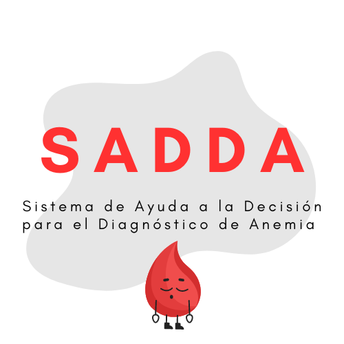
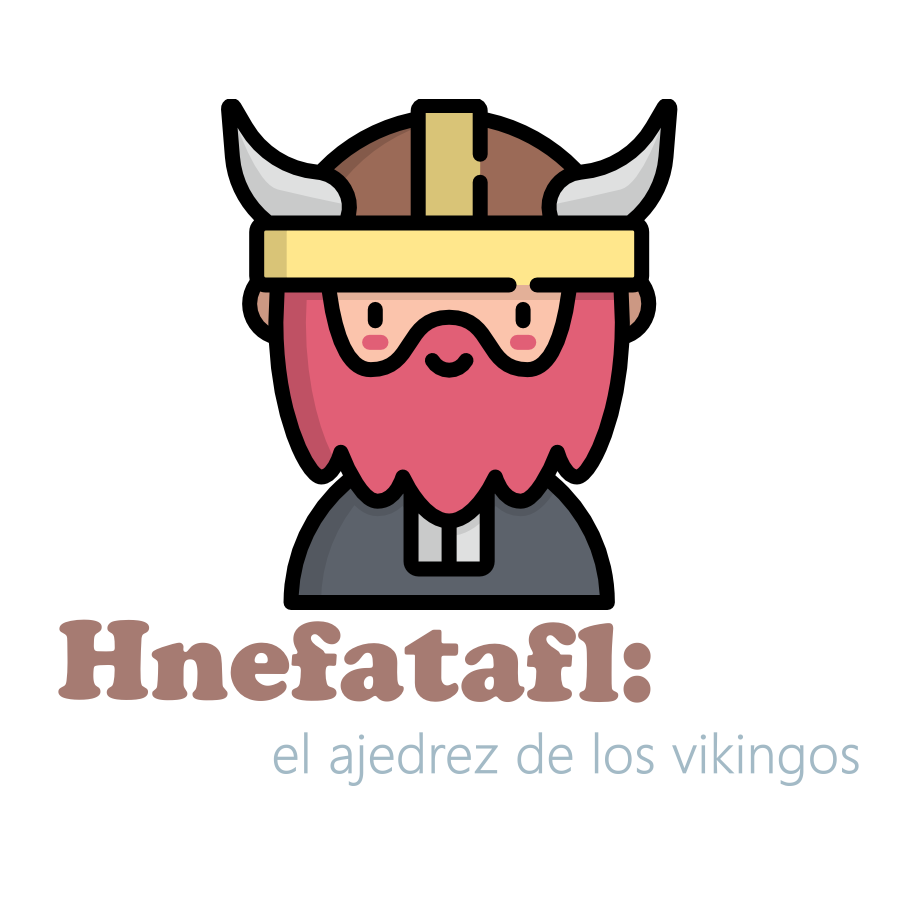

<h1 align="center">Bienvenid@ 👋, soy Francisco Javier Luna Ortiz</h1>
<h3 align="center">Estudiante de Ingeniería Informática, apasionado de la tecnología y el aprendizaje continuo.📕</h3>
 
<h2 align="center">Proyectos 💻</h2>
<h3>🩸Sistema de Ayuda a la Decisión para el Diagnóstico de Anemia (SADDA)</h3>
El sistema experto SADDA nace con el propósito de facilitar a los profesionales sanitarios el diagnóstico de anemia. La anemia es un trastorno común que afecta a millones de personas en todo el mundo y puede tener graves implicaciones para la salud si no se diagnostica y trata adecuadamente.
  

    
     
    <a href="URL_DE_TU_PAGINA" target="_blank">Ver más</a>
  

   
   

<h3>❣️ FisioVida </h3>
FisioVida es una aplicación de escritorio diseñada para gestionar la información de una clínica de fisioterapia. Permite la administración de pacientes, historiales médicos, citas y personal de la clínica, realizando operaciones de altas, bajas, modificaciones y consultas de información.
  

    
     
    <a href="URL_DE_TU_PAGINA" target="_blank">Ver más</a>
  

   
   

<h3>🍄 Sistema de Ayuda a la Decisión para la Identificación de Hongos Agaricomycetes (SADIHA)</h3>
SADIHA es un sistema experto diseñado para facilitar la identificación de hongos Agaricomycetes. Utiliza Prolog como motor de inferencia, donde las reglas y hechos se usan para responder consultas por el usuario.
  

    
     
    <a href="URL_DE_TU_PAGINA" target="_blank">Ver más</a>
  

   
   

<h3>🎮 Hnefatafl, el ajedrez de los vikingos </h3>
Hnefatafl es una aplicación de escritorio que emula el clásico juego de mesa nórdico en versión digital.
  

    
     
    <a href="URL_DE_TU_PAGINA" target="_blank">Ver más</a>
  

<h3>📊 Proyecto Ingeniería del Software</h3>

  

    
     
    <a href="https://github.com/RedBed24/ISO2-2023-B05.git" target="_blank">Ver más</a>
  

